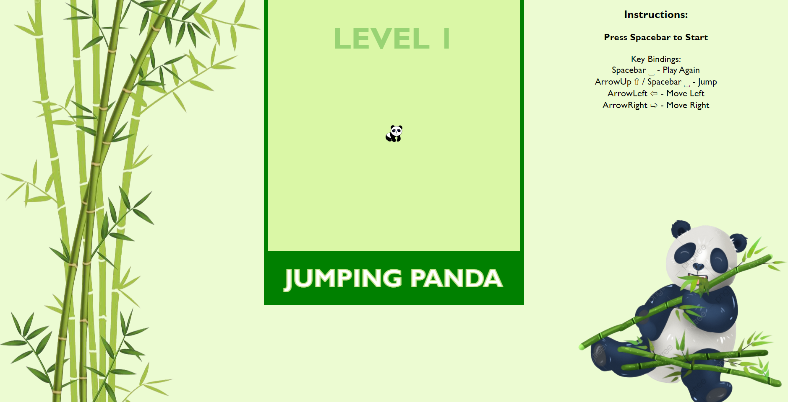
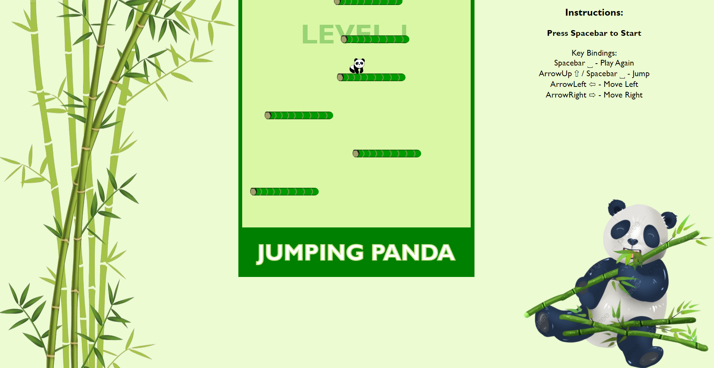

Podgląd

Opis gry

Jumping Panda to gra, w której mała panda wskakuje coraz wyżej po pędach bambusa. Celem gry jest uzyskanie jak największej liczby punktów. Dodatkowe punkty są dodawane za przejście na wyższy poziom ze względu na to, że gra przyspiesza swoje działanie. Gdy panda spadnie, rozgrywka zostaje zakończona.

Atrakcyjność

Dzięki nieskomplikowanemu sterowaniu Jumping Panda stanowi świetną rozrywkę dla dzieci i dorosłych. Na wyższych poziomach stanowi niemałe wyzwanie dla użytkownika. Gra jest przyjemnym umilaczem czasu, a przy tym rozwija refleks. Przyciąga użytkownika swoją prostotą, krótkim czasem gry i perspektywą zdobywania jak największej ilości punktów.

Sterowanie i grywalność

Aby rozpocząć grę, wciśnij spację.

Skok: ⇧ lub Spacja

Ruch w prawo: ⇨

Ruch w lewo: ⇦

Panda może przeskakiwać przez ścianę, co ułatwia wskakiwanie na odległe płytki z bambusa. 

Pomysł na dalszy rozwój gry: 

-Możliwość zmiany tła i wyglądu postaci przez użytkownika. 

-Przedmioty pojawiające się losowo na pędach bambusa, które stanowią dodatkowy bonus punktów.

Na zaawansowanym etapie produkcji ciekawym pomysłem byłby sklep (itemshop) i ranking użytkowników.  

